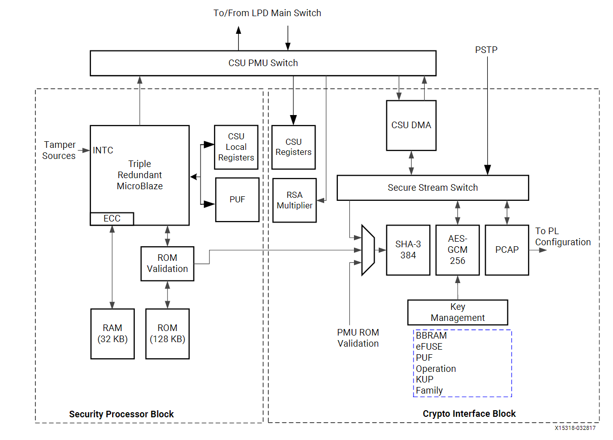

# FPGA_MultiBoot
A project focused on implementing multi-hardware configuration functionality on a Xilinx SOC with the goal of improvying dynamic high performance systems.
Done on a Kria KV260 which features a ZYNQ UltraScale+ MPSoC.

## Goal 
Improving high performance heterogenous computer systems by enabling switching between performance and power focuses. 

# Hardware Setup

# Questions
## Typical setup?
I think this answer would define some of my other questions, but what will a typical setup look like?

## General
What type of functionality will require reprogramming?
How often will the reprogramming occur? 
What is the expected downtime or latency during reprogramming?
 - This decides partial vs full image reprogramming

What are the throughput or performance requirements of the system during reprogramming?
 - ie. can it go under? If so, for how long?

Should reprogramming occur autonomously, based on specific conditions, or via external commands? 
Where will images be stored?
 - This drives if the processor is involved, what type of interface

Will reprogramming use an operating system (e.g., Linux on the PS) or be controlled bare-metal?
 - for PS driven only

How will bitstreams be validated before deployment?
 - SHA?
How will failures during reprogramming be handled?
 - Suggest Golden image
   
What mechanisms ensure data consistency during the transition period?

What data will we capture during reprogramming?
 - programming time
 - Bit stream file size
 - Power consumption
 - Could then find ratio of new to old bitstream file and relate it to programming time

# Requirements
WIll fill in as it develops
 - Memory requirements
 - Power requirements

# Development
## PS Driven Full image
### Crawl
Boot full image from non-violatile memory

### Walk
PS to initiate reprogramming from memory (same image)

### Run
Store second image in memory, offset from original
PS to initiate reprogramming from memory (second image)

# Resources
## Other Research
DATE'24 and DAC'22 are reference papers. I discuss them in /docs "DATE-24.md" and "DAC-22.md"

## PCAP
The PCAP interface is used by the PS to program the PL. 

This shows that the PCAP must be selected through setting the SSS register
From: UG117 pg 17

## Drivers
Xilinx has provided a driver class already: https://github.com/Xilinx/embeddedsw/tree/master/lib/sw_services/xilfpga
https://xilinx-wiki.atlassian.net/wiki/spaces/A/pages/18841910/Xilfpga

Might need to config debug driver: https://github.com/Xilinx/embeddedsw/blob/master/XilinxProcessorIPLib/drivers/devcfg/src/xdevcfg.c

# Future Developments
Pull images/DFX cores from remote server.
PL only reprogramming.
